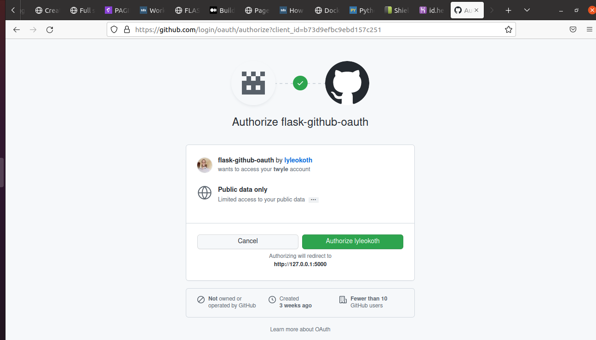
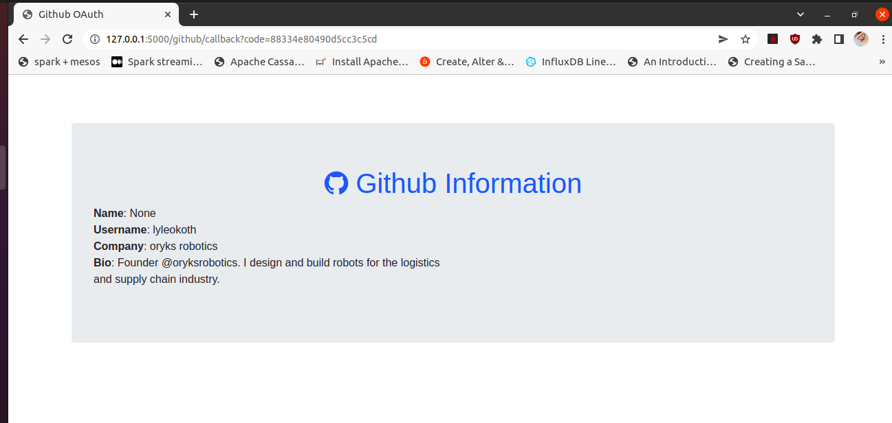

# GitHub OAuth Application.
> This application authenticates a user using the GitHub OAuth API.

[](https://flask-react-blog-dev.herokuapp.com/)
[![security: bandit][bandit-image]][bandit-url]
[![Imports: isort][isort-image]][isort-url]
[![Feature Development Build][feature-development-image]][feature-development-url]
[![Development Build][development-image]][development-url]
[![Production Build][staging-image]][production-url]
[](https://www.python.org/)
[](https://github.com/Naereen/StrapDown.js/blob/master/LICENSE)


This application allows a user to authenticate themselves using their GitHub credentials. You can read more about it, including how it was developed over at .


## Installation

### Clone the [GitHub OAuth Application repo](https://github.com/twyle/github-oauth-app.git)

```sh
git clone https://github.com/twyle/github-oauth-app.git
```

### Navigate into the cloned repo

```sh
cd github-oauth-app
```

### Create a Python3 Virtual Environment.

OS X & Linux:

```sh
python3 -m venv venv
```

Windows:

```sh
python3 -m venv venv
```

### Activate the Virtual Environment.

OS X & Linux:

```sh
source venv/bin/activate
```

Windows:

```sh
venv\\Scripts\\Activate
```

### Install the Project dependencies.

```sh
make install
```

### Run the application.

```sh
make run
```

## Usage example

### After the application is run, click on the GitHub Login button:


### The application will direct to a page that will request you to authorize the app:



### You will then be redirected to a dashboard that displays your information.



## Development setup

Here is how to setup your development environment incase you want to play around with this project.

### Install the development dependencies (make sure you have set up the virtual environment as stated above and are in the project folder)

```sh
make install-dev
```

### Run the unit tests

```sh
make test
```

## Release History

## v0.1.0 (2022-04-08)

### Feat

- added more badges.
- added more badges.
- added more badges.
- added more badges.
- added the feature development badge.
- added the feature development badge.
- added the feature development badge.
- added the feature development badge.
- added the feature development badge.
- added the pre-commit.
- added the pre-commit.
- added the pre-commit.
- added the pre-commit.
- added isort to the pre-config file
- altered the badge structure.
- altered the badge structure.
- added the workflows.
- added the workflows.

### Fix

- fixed the linting errors.
- fixed isort.

## Meta

Lyle Okoth – [@lylethedesigner](https://twitter.com/lylethedesigner) on twitter – [lyle okoth](https://medium.com/@lyle-okoth) on medium, and my email is lyceokoth@gmail.com

Distributed under the MIT license. See ``LICENSE`` for more information.

[https://github.com/twyle/github-link](https://github.com/twyle/)

## Contributing

1. Fork it https://github.com/twyle/github-oauth-app/fork
2. Create your feature branch (`git checkout -b feature/fooBar`)
3. Commit your changes (`git commit -am 'Add some fooBar'`)
4. Push to the branch (`git push origin feature/fooBar`)
5. Create a new Pull Request

<!-- Markdown link & img dfn's -->
[wiki]: https://github.com/yourname/yourproject/wiki

[bandit-image]: https://img.shields.io/badge/security-bandit-yellow.svg
[bandit-url]: https://github.com/PyCQA/bandit

[isort-image]: https://img.shields.io/badge/%20imports-isort-%231674b1?style=flat&labelColor=ef8336
[isort-url]: https://pycqa.github.io/isort/

[feature-development-image]: https://github.com/twyle/flask-react-blog-simple/actions/workflows/feature-development-workflow.yml/badge.svg?branch=feature%2Fworkflows
[feature-development-url]: https://github.com/twyle/flask-react-blog-simple/actions/workflows/feature-development-workflow.yml

[development-image]: https://github.com/twyle/github-oauth-app/actions/workflows/development-workflow.yml/badge.svg
[development-url]: https://github.com/twyle/github-oauth-app/actions/workflows/development-workflow.yml

[staging-image]: https://github.com/twyle/flask-react-blog-simple/actions/workflows/staging-workflow.yml/badge.svg
[staging-url]: https://github.com/twyle/flask-react-blog-simple/actions/workflows/staging-workflow.yml

[production-image]: https://github.com/twyle/flask-react-blog-simple/actions/workflows/production-workflow.yml/badge.svg
[production-url]: https://github.com/twyle/flask-react-blog-simple/actions/workflows/production-workflow.yml
